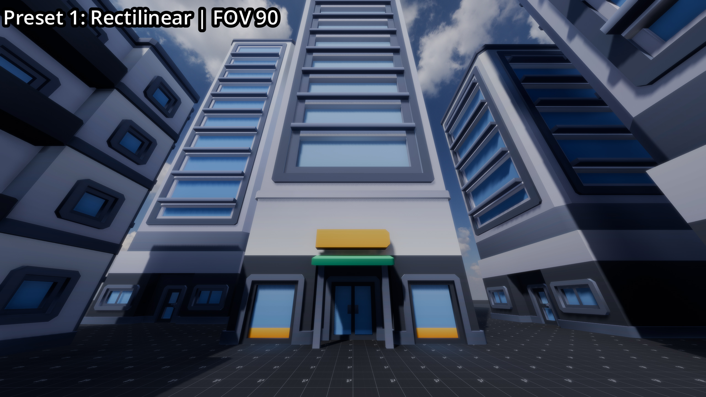
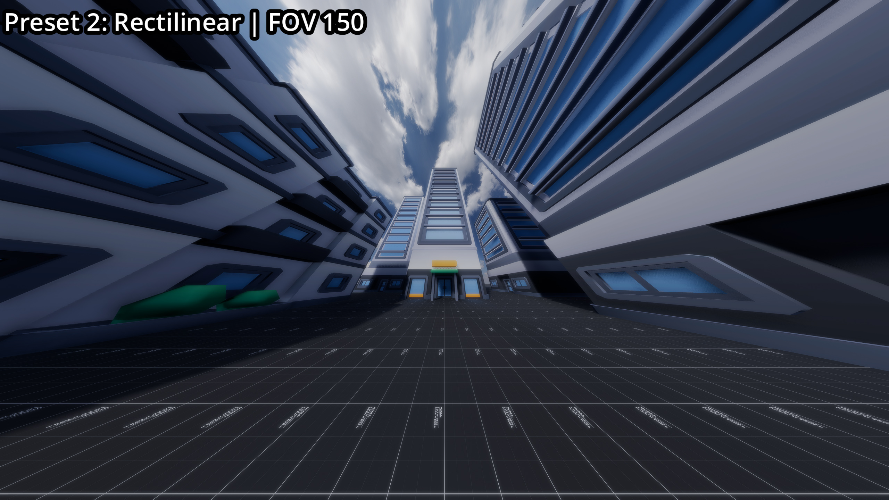

# Screenspace Perspective Projection for Godot

**High-FOV rendering with Panini projection and alternative lens models**

[](https://www.youtube.com/watch?v=LE9kxUQ-l14)

---

## What It Solves

Standard rectilinear projection breaks down at extreme FOV (all FOVs in this README are vertical).
Most games ship around ~75° FOV, and most players rarely go above ~100° FOV horizontally:

- **High FOV (120°+)**: edge stretching and exaggerated motion (feel like you're moving faster by increasing FOV)
- **Medium FOV (75°)**: claustrophobic feeling and lack of environmental awareness

This project makes higher FOVs usable by remapping the rendered image through lens-style projections as a post-processing pass.

This project:
- Allows 120–150° vertical FOV without heavy edge stretching: more awareness of environment
- Allows stylized effects e.g. fisheye or bodycam
- Increases visibility in small spaces
- Reduces exaggerated motion at high FOVs.

---

## Demo Images






_FOV_150.jpg)

_FOV_150.jpg)


---

## Quick start

Requires Forward+ renderer for FSR2. It can work without FSR2, but performance and quality will be worse.

### Demo

1. Open in Godot 4.x (tested in 4.6)
2. Run the demo scene
3. Press **1–8** for projections, **Q** for UI, **E** for day/night

> Try: `2` (150° rectilinear) vs `4` (150° Panini)

### Integration

The "addon" is just a scene, it **DOES NOT** need to be enabled in `Project Settings → Plugins`

1. Add `addons/screenspace_projection/screenspace_projection.tscn` to your scene
2. Parent your 3D world to `ScreenSpaceProjection/ProjectionInput`
3. Put UI and post-effects outside the `ScreenSpaceProjection` node
4. Adjust parameters in the inspector

---

## How it works
```
Main (Node3D)
├── ScreenSpaceProjection (Projection Controller)
│ ├── _ProjectionOutput (MeshInstance3D) ← fullscreen quad + shader
│ └── ProjectionInput (SubViewport)
│   ├── Level0 (your 3D scene)
└── UI (Control)
```

**Pipeline:** scene renders → pre-lens post-effects → shader remaps through lens → post-lens post-effects → UI

---

## Projections

- **Panini** (recommended): wide-angle correction, keeps vertical lines straight and lines from center of screen straight
  - Best for 90–150° FOV. Typical `strength`: 0.3–0.5.
- **Rectilinear**: standard perspective (reference)
- **Cylindrical / Spherical**: panoramic mappings
- **Fisheye**: extreme wide-angle (>150°)

---

## Configuration

- **`projection_mode`** – projection type
- **`strength`** – intensity (Panini D 0–1, others blend 0–1)
- **`fill`** – auto-zoom to hide corners
- **`upscale`** – SubViewport resolution multiplier
- **`supersample_upscale_amount`** – how much of extra resolution comes from upscaling (FSR2) vs supersampling

**Recommended quality / performance setup**

- start at `upscale: 1.0`
- enable FSR2
- increase to `2.0–2.5` if the center gets soft
- typical FSR2 use: `upscale: 2.0–2.5`, `supersample: 0.3–0.5`

**Optional lens effects**

- chromatic aberration (BK7 dispersion)
- vignette (cos⁴ falloff)

**Sampling**

- anisotropic filtering via `max_major_radius`, `max_minor_radius`

**Common issues**

- soft center → increase `upscale` and use FSR2
- shimmer in center when not moving due to FSR2 → use `MSAA 2x` (expensive)
- aliasing on edges of screen → increase `max_major_radius/max_minor_radius`
- black corners → increase `fill`
- distorted UI → place UI outside `ProjectionInput` viewport

---

## Effect ordering

This projection acts like a lens stage.
Effects that rely on scene buffers must run before it.
Color-only effects should run after it.

| Before lens (inside SubViewport Camera) | After lens (on `ScreenSpaceProjection` camera) |
|-----------------------------------------|------------------------------------------------|
| SSR                                    | Film grain                                    |
| SSAO                                   | Auto exposure                                 |
| SSGI                                   | Bloom / glow                                  |
| Volumetric fog                         | Color grading / LUT                           |
| Depth of field                         | Tonemapping                                   |
| Motion blur                            |                                               |
| Upscaling (FSR2)                       |                                               |

Chromatic aberration and vignette are applied inside the projection shader itself, so they happen inside the lens and follow the projection distortion.

UI should be drawn on top of projection output, outside the `ProjectionInput` viewport.

---

## License

- `assets/` folder: **CC0 license**
- `addons/` folder and rest of project: **MIT license**
